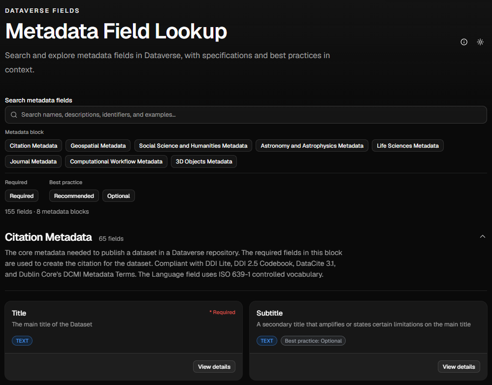

# Dataverse Metadata Field Lookup



Dataverse Metadata Field Lookup is a static Astro application for searching and browsing metadata blocks and fields in a Dataverse installation, with specifications and context.

The audience of this tool is primarily:
1. Researchers - to understand the available fields when depositing data, and to learn best practices for using them.
2. Curators - to understand the available fields when curating/reviewing datasets.

## Features
- Search the definitions of metadata fields and blocks in a Dataverse installation.
- Full-text search across each field's added context, including best practices and examples.
- Browse available metadata fields by block.
- Filter fields by metadata block, required-only, and best practice tier (Recommended/Optional).


## Prerequisites

- Node.js 22.12.0 or newer
- [pnpm](https://pnpm.io/)

## Development

Install dependencies:

```bash
pnpm install
```

Start Astro's background development server and manage it with:

```bash
pnpm astro dev --background
pnpm astro dev status
pnpm astro dev logs
pnpm astro dev stop
```

Run automated verification and create a production build:

```bash
pnpm test
pnpm check
pnpm build
```

## Release
This repository uses [release-it](https://github.com/release-it/release-it) to automate versioning and changelog generation. To create a new release, run:

```bash
pnpm release
```

## Data and deployment

The site deploys to GitHub Pages under the `/dv-fields-lookup/` base path via [`.github/workflows/deploy.yml`](.github/workflows/deploy.yml), on every push to `main` and on manual workflow dispatch. One repository setting is required, once: in **Settings → Pages**, set **Source** to **GitHub Actions**.

### Metadata schema

Astro validates `src/data/metadata.json` at render time, so real metadata can replace the demonstration dataset without touching the application shell, as long as it matches the expected shape. See [docs/schema.md](docs/schema.md) for that schema, or [src/lib/metadata.ts](src/lib/metadata.ts) for the TypeScript types.

To check the data before a build or deployment:

```bash
pnpm test src/lib/metadata.test.ts
```

## Acknowledgments
The bestPracticeDefinition text is from the [Dataverse North Metadata Best Practices Guide v 3.0](https://doi.org/10.5281/zenodo.5668945), license under CC-BY 4.0.

## License
[Apache License 2.0](LICENSE)